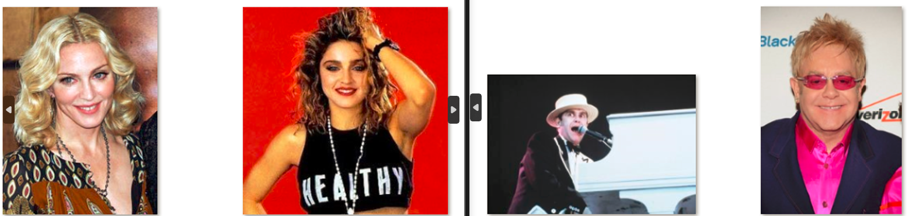

# Prepoznavanje lica u slikama

**Tema 13 — Prepoznavanje lica u slikama**  
Autori: Franjo Markić (II-116) i Edina Kaknjo (II-112)

## Kratak opis

Implementacija sistema za prepoznavanje i identifikaciju osoba na osnovu slika lica, korištenjem metoda dubokog učenja i klasičnih algoritama strojnog učenja.

## Dataset

Korišten je [5 Celebrity Faces Dataset](https://www.kaggle.com/dansbecker/5-celebrity-faces-dataset), koji sadrži samo 128 slika za 5 osoba. Kvaliteta skupa podataka je loša – slike su preuzete iz različitih perioda života svake osobe, s jakim razlikama u izgledu, što otežava pouzdano prepoznavanje čak i ljudskom oku.

Zbog toga je obavljeno opsežno proširivanje i augmentacija podataka, kao i djelomična dopuna dataseta. Detalji su opisani u fajlu `prepairing_data.py`.

Ispod su prikazani primjeri osoba iz originalnog dataseta kako bi se težina zadatka.

## Opis problema

Treniranje modela za prepoznavanje lica na malom skupu podataka je izrazito izazovno. Čak i nakon proširivanja dataseta, treniranje i dotreniranje postojećih modela bilo je zahtjevno.

ResNet arhitektura nije davala zadovoljavajuće rezultate, dok se kao najstabilnije rješenje pokazala kombinacija FaceNet/ArcFace embeddera i SVM klasifikatora.

## Pristup i korištene metode

### CNN pristup

- Arhitektura: ResNet-18 (pretrenirana na ImageNet)
- Fine-tuning:
  - Prvo se trenirao samo novi "fully connected" sloj.
  - Zatim otključan zadnji blok (layer4).
  - Ostali slojevi ostali fiksni.
- Korišteni alati:
  - `CrossEntropyLoss`
  - `Adam` optimizator
  - `StepLR` scheduler (pad svakih 5 epoha)
  - `Weight decay`: 1e-4
- Augmentacije:
  - `RandomResizedCrop`, rotacije, `ColorJitter`, grayscale, horizontalni flip

**Rezultati**:  
Tačnost je narasla s 26% na 97% unutar 8 epoha, ali se nakon toga model prenaučio i nije generalizirao na nove slike.

### KNN i SVM pristup

- Koristi se gotov duboki embedder (npr. FaceNet) koji pretvara slike u 128-dimenzionalne vektore (embeddings).
- Na te vektore primijenjeni su klasični klasifikatori:
  - **KNN** (K=3): temeljen na većinskom glasanju najbližih susjeda
  - **SVM**: linearna klasifikacija u prostoru embeddinga

**Prednosti**:
- Nema treniranja dubokog modela – koristi se gotov, robustan embedder
- Snažna generalizacija na nove slike
- Jednostavno dodavanje novih osoba (samo dodati njihove embeddings)

**Rezultati**:
- Više od 90% tačnosti na novim, neviđenim slikama
- Stabilni rezultati pri promjeni testnog skupa

## Zaključak

U uvjetima ekstremno ograničenog skupa podataka, kombinacija gotovog dubokog modela za generisanje embeddinga i klasičnih metoda klasifikacije (KNN/SVM) pokazala se daleko otpornijom i robusnijom od standardnih CNN pristupa.

Za više detalja  i zasebne korake pogledati dostavljene notebook-e.
